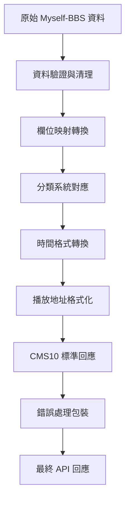

# Myself-BBS API 轉換為 CMS10 規格 - 總結報告

## 規格異動日期時間

**建立日期**: 2025-07-26 15:38:00 (UTC+8)
**版本**: v1.0
**專案狀態**: 規劃完成，準備進入實作階段

## 1. 專案概覽

### 1.1 目標

將現有的 Myself-BBS API 轉換為符合 CMS10 標準的影片 API，提供標準化的視頻點播服務介面。

### 1.2 核心需求

- 保持向後相容性，原有 API 端點繼續運作
- 新增 CMS10 標準相容的 API 端點
- 實現資料格式的無縫轉換
- 提供完整的錯誤處理機制

## 2. 技術架構設計

### 2.1 API 端點架構

```
現有端點 (保留)                    新增 CMS10 端點
├── /list/airing                  ├── /api.php/provide/vod/?ac=videolist
├── /list/completed               ├── /api.php/provide/vod/?ac=detail
├── /anime/{id}                   └── /api.php/provide/vod/?ac=videolist&wd={query}
├── /anime/all
├── /search/{query}
└── /m3u8/{id}/{ep}
```

### 2.2 資料轉換流程



## 3. 關鍵設計決策

### 3.1 資料欄位映射

| 轉換類型 | Myself-BBS                         | CMS10      | 轉換邏輯       |
| -------- | ---------------------------------- | ---------- | -------------- |
| 基本資訊 | `id` → `vod_id`                    | 直接對應   | 數值轉換       |
| 標題     | `title` → `vod_name`               | 直接對應   | 字串保持       |
| 分類     | `category[]` → `type_id/type_name` | 映射表轉換 | 取第一個分類   |
| 時間     | `timestamp` → `vod_time`           | 格式轉換   | UTC+8 時區     |
| 播放地址 | `episodes{}` → `vod_play_url`      | 格式重組   | 集數$地址#格式 |

### 3.2 分類系統設計

建立了完整的分類映射表，涵蓋動畫常見分類：

- 動作 (type_id: 1)
- 冒險 (type_id: 2)
- 科幻 (type_id: 3)
- 奇幻 (type_id: 4)
- 日常 (type_id: 5)
- 戀愛 (type_id: 6)
- 喜劇 (type_id: 7)
- 劇情 (type_id: 8)
- 懸疑 (type_id: 9)
- 恐怖 (type_id: 10)
- 其他 (type_id: 99)

### 3.3 錯誤處理策略

採用 CMS10 標準錯誤碼：

- `1`: 請求成功
- `0`: 系統錯誤
- `-1`: 參數錯誤
- `-2`: 資料不存在

## 4. 實作規劃

### 4.1 開發階段

1. **第一階段**: 核心轉換函式開發

   - 實作資料欄位映射函式
   - 建立分類映射邏輯
   - 開發時間和播放地址轉換

2. **第二階段**: API 端點實作

   - 新增 CMS10 路由處理
   - 整合轉換函式
   - 實作分頁和搜尋功能

3. **第三階段**: 錯誤處理和驗證

   - 建立參數驗證機制
   - 實作錯誤處理中介軟體
   - 完善日誌記錄

4. **第四階段**: 測試和優化
   - 執行完整測試套件
   - 效能調優
   - 文件完善

### 4.2 技術實作要點

#### 4.2.1 路由整合

```javascript
// 新增 CMS10 相容路由
router.get(
  "/api.php/provide/vod/",
  withErrorHandling(async (request) => {
    const { query } = request;
    const validation = validateQuery(query);

    if (!validation.isValid) {
      throw createParameterError("query", validation.errors.join("; "));
    }

    switch (validation.params.ac) {
      case "video":
        return await handleCms10List(validation.params);
      case "detail":
        return await handleCms10Detail(validation.params);
      default:
        throw createParameterError("ac", "不支援的操作類型");
    }
  }),
);
```

#### 4.2.2 資料轉換核心

```javascript
function convertListResponse(myselfData, query = {}, options = {}) {
  // 1. 提取和篩選資料
  let items = myselfData?.data?.data || [];

  // 2. 應用篩選條件
  if (query.t) items = filterByCategory(items, query.t);
  if (query.wd) items = searchByKeyword(items, query.wd);
  if (query.h) items = filterByUpdateTime(items, query.h);

  // 3. 分頁處理
  const { data: paginatedData, pagination } = paginateData(items, query.pg, 20);

  // 4. 轉換為 CMS10 格式
  const cms10Items = batchConvertItems(paginatedData, "list", options);

  // 5. 建立標準回應
  return createSuccessResponse(cms10Items, pagination);
}
```

## 5. 品質保證

### 5.1 測試策略

- **單元測試**: 覆蓋所有轉換函式和工具函式
- **整合測試**: 驗證 API 端點完整流程
- **相容性測試**: 確保符合 CMS10 標準
- **回歸測試**: 保證原有功能不受影響

### 5.2 驗收標準

- 所有 CMS10 API 端點正常運作
- 資料轉換準確率 100%
- 原有 API 功能保持不變
- 錯誤處理符合規範
- 測試覆蓋率 ≥ 80%

## 6. 部署計劃

### 6.1 部署策略

1. **開發環境**: 完整功能開發和測試
2. **測試環境**: 完整的相容性和效能測試
3. **預生產環境**: 最終驗證和壓力測試
4. **生產環境**: 漸進式部署，監控回饋

### 6.2 風險控制

- 保留原有 API 端點，確保向後相容
- 實作功能開關，可快速回滾
- 建立完整的監控和告警機制
- 準備詳細的回滾計劃

## 7. 監控和維護

### 7.1 關鍵指標

- API 回應時間
- 錯誤率統計
- 資料轉換準確性
- 使用量分析

### 7.2 維護計劃

- 定期檢查轉換邏輯的準確性
- 監控新增分類的需求
- 持續優化效能
- 更新文件和測試

## 8. 文件清單

本次規劃產出的完整文件：

1. **[`cms10-conversion-analysis.md`](cms10-conversion-analysis.md)** - 轉換分析文件

   - 現有 API 資料結構分析
   - CMS10 規格要求分析
   - 資料結構對應關係
   - 關鍵轉換挑戰

2. **[`cms10-field-mapping.md`](cms10-field-mapping.md)** - 欄位映射表

   - 詳細的欄位對應關係
   - 轉換函式實作
   - 分類系統映射
   - 時間和播放地址轉換邏輯

3. **[`cms10-api-endpoints.md`](cms10-api-endpoints.md)** - API 端點規劃

   - 新增端點結構設計
   - 參數處理邏輯
   - 路由整合方案
   - 分頁和搜尋實作

4. **[`cms10-response-functions.md`](cms10-response-functions.md)** - 回應格式函式

   - 標準化轉換函式
   - 批量處理邏輯
   - 資料驗證機制
   - 使用範例

5. **[`cms10-error-handling.md`](cms10-error-handling.md)** - 錯誤處理規劃

   - 錯誤分類體系
   - 狀態碼對應
   - 參數驗證邏輯
   - 錯誤監控機制

6. **[`cms10-testing-plan.md`](cms10-testing-plan.md)** - 測試計劃
   - 完整測試策略
   - 單元和整合測試
   - 相容性驗證
   - 手動測試清單

## 9. 下一步行動

### 9.1 立即行動項目

1. **環境準備**: 設定開發和測試環境
2. **依賴安裝**: 確認所需的開發工具和函式庫
3. **專案結構**: 建立新的檔案結構和模組組織

### 9.2 開發順序建議

1. 先實作核心轉換函式 (cms10-response-functions.md)
2. 建立錯誤處理機制 (cms10-error-handling.md)
3. 實作 API 端點 (cms10-api-endpoints.md)
4. 執行測試驗證 (cms10-testing-plan.md)

### 9.3 關鍵里程碑

- **Week 1**: 核心轉換函式完成
- **Week 2**: API 端點實作完成
- **Week 3**: 測試和除錯
- **Week 4**: 部署和上線

## 10. 成功標準

### 10.1 技術標準

- ✅ 完全符合 CMS10 API 規格
- ✅ 保持 100% 向後相容性
- ✅ 資料轉換準確率 100%
- ✅ API 回應時間 < 3 秒
- ✅ 錯誤處理覆蓋率 100%

### 10.2 業務標準

- ✅ 現有用戶端無需修改
- ✅ 支援 CMS10 標準的新用戶端
- ✅ 提供完整的 API 文件
- ✅ 建立監控和維護機制

## 11. 結論

本次規劃已完成 Myself-BBS API 轉換為 CMS10 規格的完整技術方案設計。規劃涵蓋了：

- **完整的技術架構**: 從資料轉換到 API 端點的全面設計
- **詳細的實作指南**: 包含具體的程式碼範例和實作邏輯
- **全面的品質保證**: 測試策略和驗收標準
- **風險控制機制**: 向後相容和回滾方案

所有規劃文件已準備完成，可以直接進入實作階段。建議按照既定的開發順序和里程碑執行，確保專案順利完成。

---

**專案狀態**: ✅ 規劃階段完成
**下一階段**: 🚀 準備進入實作階段
**預計完成時間**: 4 週內完成開發和部署
