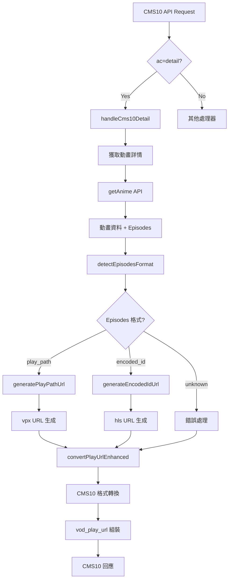
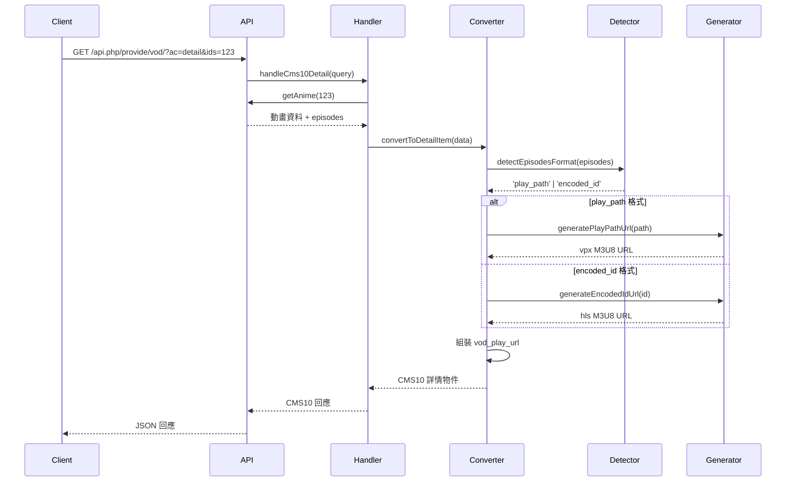
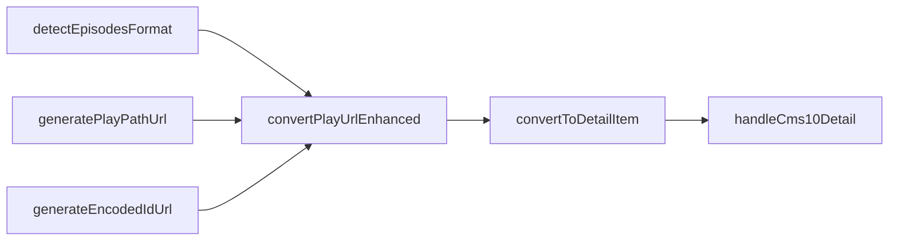

# CMS10 第二階段：技術架構設計

## 系統架構圖



## 資料流程圖



## 模組架構

### 1. 核心模組結構

```
src/cms10/
├── converters.js          # 主要轉換器 (現有)
├── episode-detector.js    # Episodes 格式檢測器 (新增)
├── url-generators.js      # URL 生成器 (新增)
├── handlers.js           # API 處理器 (更新)
└── tests/
    └── phase2-tests.js   # 第二階段測試 (新增)
```

### 2. 函式依賴關係



## 詳細設計規格

### 1. Episodes 格式檢測器

**檔案**: `src/cms10/episode-detector.js`

```javascript
/**
 * Episodes 格式檢測和分析模組
 */

// 格式類型常數
export const EPISODE_FORMATS = {
  PLAY_PATH: "play_path",
  ENCODED_ID: "encoded_id",
  UNKNOWN: "unknown",
};

// 格式檢測規則
const FORMAT_PATTERNS = {
  PLAY_PATH: /^play\/\d+\/\d+$/,
  ENCODED_ID: /^[A-Za-z0-9_-]+$/,
};
```

### 2. URL 生成器

**檔案**: `src/cms10/url-generators.js`

```javascript
/**
 * M3U8 URL 生成器模組
 */

// URL 模板
const URL_TEMPLATES = {
  VPX: "https://vpx05.myself-bbs.com/vpx/{path}/720p.m3u8",
  HLS: "https://vpx05.myself-bbs.com/hls/{segments}/index.m3u8",
};

// 編碼 ID 分割邏輯
function splitEncodedId(encodedId) {
  // AgADMg4AAvWkAVc -> Mg/4A/Av
  const segment1 = encodedId.substring(4, 6); // Mg
  const segment2 = encodedId.substring(6, 8); // 4A
  const segment3 = encodedId.substring(8, 10); // Av
  return `${segment1}/${segment2}/${segment3}`;
}
```

### 3. 增強版轉換器

**更新**: `src/cms10/converters.js`

```javascript
/**
 * 增強版 convertPlayUrl 函式
 */
function convertPlayUrlEnhanced(episodes, vodId, options = {}) {
  // 1. 格式檢測
  const format = detectEpisodesFormat(episodes);

  // 2. 根據格式選擇生成器
  const generator = getUrlGenerator(format);

  // 3. 批量處理 episodes
  const playUrls = processEpisodes(episodes, generator);

  // 4. 組裝 CMS10 格式
  return playUrls.join("#");
}
```

## 錯誤處理策略

### 1. 格式檢測失敗

```javascript
// 當無法識別 episodes 格式時的降級策略
if (format === EPISODE_FORMATS.UNKNOWN) {
  console.warn(`未知的 episodes 格式: ${JSON.stringify(episodes)}`);
  return generateFallbackUrl(episodes, vodId);
}
```

### 2. URL 生成失敗

```javascript
// 當 URL 生成失敗時的處理
try {
  return generator(episodeData);
} catch (error) {
  console.error(`URL 生成失敗: ${error.message}`);
  return generateDefaultUrl(episodeName, vodId);
}
```

### 3. 資料完整性檢查

```javascript
// 檢查 episodes 資料的完整性
function validateEpisodesData(episodes) {
  if (!episodes || typeof episodes !== "object") {
    throw new Error("Episodes 資料無效");
  }

  const entries = Object.entries(episodes);
  if (entries.length === 0) {
    throw new Error("Episodes 資料為空");
  }

  return true;
}
```

## 效能優化

### 1. 快取策略

```javascript
// 格式檢測結果快取
const formatCache = new Map();

function detectEpisodesFormatCached(episodes) {
  const cacheKey = generateCacheKey(episodes);

  if (formatCache.has(cacheKey)) {
    return formatCache.get(cacheKey);
  }

  const format = detectEpisodesFormat(episodes);
  formatCache.set(cacheKey, format);

  return format;
}
```

### 2. 批量處理優化

```javascript
// 並行處理多個 episodes
async function processEpisodesBatch(episodes, generator) {
  const entries = Object.entries(episodes);

  const promises = entries.map(async ([name, data]) => {
    try {
      const url = await generator(data);
      return `${name}$${url}`;
    } catch (error) {
      console.warn(`處理 episode 失敗: ${name}`, error);
      return null;
    }
  });

  const results = await Promise.all(promises);
  return results.filter((result) => result !== null);
}
```

## 測試策略

### 1. 單元測試覆蓋

- ✅ 格式檢測器測試
- ✅ URL 生成器測試
- ✅ 轉換器整合測試
- ✅ 錯誤處理測試
- ✅ 邊界情況測試

### 2. 整合測試

- ✅ 完整 API 流程測試
- ✅ 不同格式混合測試
- ✅ 效能基準測試
- ✅ 相容性測試

### 3. 測試資料準備

```javascript
// 測試用的 episodes 資料
export const TEST_EPISODES = {
  PLAY_PATH_FORMAT: {
    "第 01 話 海的那邊": "play/46442/001",
    "第 02 話 暗夜列車": "play/46442/002",
  },

  ENCODED_ID_FORMAT: {
    "第 01 話": "AgADMg4AAvWkAVc",
    "第 02 話": "AgADsA0AAjef-VU",
  },

  MIXED_FORMAT: {
    "第 01 話": "play/46442/001",
    "第 02 話": "AgADMg4AAvWkAVc",
  },
};
```

## 部署和監控

### 1. 功能開關

```javascript
// 功能開關控制新功能的啟用
const FEATURE_FLAGS = {
  ENHANCED_PLAY_URL: true,
  ENCODED_ID_SUPPORT: true,
  FALLBACK_MODE: true,
};
```

### 2. 監控指標

- 格式檢測成功率
- URL 生成成功率
- API 回應時間
- 錯誤率統計
- 快取命中率

### 3. 日誌記錄

```javascript
// 結構化日誌記錄
function logEpisodeProcessing(vodId, format, episodeCount, duration) {
  console.log({
    event: "episode_processing",
    vod_id: vodId,
    format: format,
    episode_count: episodeCount,
    duration_ms: duration,
    timestamp: new Date().toISOString(),
  });
}
```

這個架構設計確保了：

1. **模組化**: 清晰的職責分離
2. **可擴展性**: 易於添加新的格式支援
3. **可維護性**: 良好的錯誤處理和日誌
4. **效能**: 快取和批量處理優化
5. **可測試性**: 完整的測試覆蓋策略
